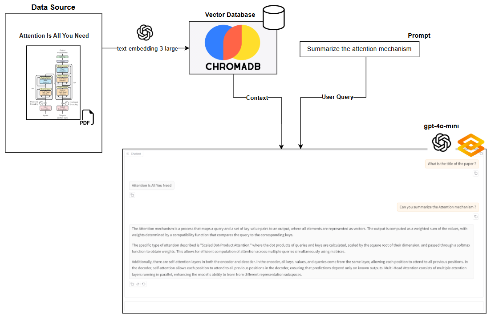

# RAG Chatbot using LangChain, OpenAI, and ChromaDB

This project is a **Retrieval-Augmented Generation (RAG) chatbot** that allows users to ask questions about PDF documents (e.g., research papers) and get intelligent answers based only on the document content.

It uses **LangChain, OpenAI, and ChromaDB** to combine document retrieval with large language models.

---

## 🚀 Features

* 📄 Load and process PDF documents
* ✂️ Split documents into semantic chunks
* 🔍 Convert text into embeddings using OpenAI
* 🧠 Store and retrieve knowledge using Chroma vector database
* 💬 Chat with documents using GPT-4o-mini
* ⚡ Streaming responses via Gradio UI
* 📚 Strict RAG mode (answers only from document context)

---

## 🧠 System Architecture (RAG Pipeline)

This diagram illustrates how documents are ingested, embedded, stored, and later retrieved to generate context-aware responses using a Retrieval-Augmented Generation (RAG) pipeline.


---

## 🧠 How It Works

1. PDF files are loaded from the `data/` folder
2. Documents are split into overlapping chunks
3. Each chunk is converted into embeddings
4. Embeddings are stored in a Chroma vector database
5. When a user asks a question:

   * The system retrieves the most relevant chunks
   * These chunks are passed to the LLM
   * The model generates an answer based ONLY on retrieved context

---

## 🏗️ Project Structure

```
.
├── ingest_data.py     # Loads PDFs and builds vector database
├── chatbot.py         # RAG chatbot with Gradio UI
├── data/              # PDF documents (e.g. research papers)
├── chroma_db/         # Vector database storage
├── .env               # OpenAI API key
```

---

## ⚙️ Setup Instructions

### 1. Clone the repository

```bash
git clone https://github.com/your-username/rag-chatbot.git
cd rag-chatbot
```

### 2. Install dependencies

```bash
pip install -r requirements.txt
```

### 3. Add OpenAI API key

Create a `.env` file:

```
OPENAI_API_KEY=your_api_key_here
```

---

## 📥 Ingest Documents

Run this script once to process PDFs and build the vector database:

```bash
python ingest_data.py
```

---

## 💬 Run the Chatbot

Start the Gradio UI:

```bash
python chatbot.py
```

Then open the local link in your browser.

---

## 🧪 Example Use Cases

* Ask questions about research papers
* Summarize sections of PDFs
* Extract key ideas from academic documents
* Build document-aware AI assistants

---

## 🛠️ Tech Stack

* Python
* LangChain
* OpenAI GPT-4o-mini
* ChromaDB
* Gradio
* PyPDF

---

## 📌 Future Improvements

* Add citation support (page numbers)
* Improve retrieval with reranking
* Support multiple document collections
* Add memory for multi-turn reasoning
* Deploy to cloud (HuggingFace Spaces / Render)

---

## 📜 License

This project is for educational purposes.
